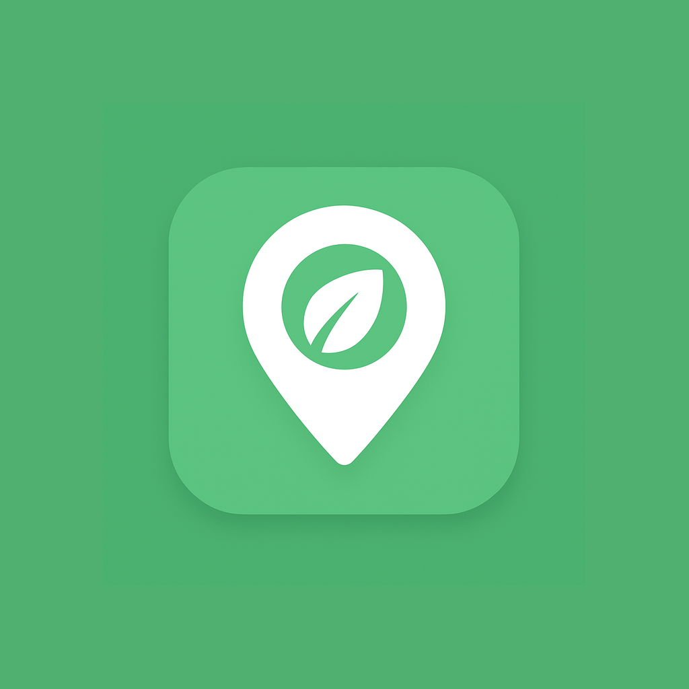

<div align="center">
  <h1>
    
    Neighbor Nosh
  </h1>

  <p>Food Redistribution Platform</p>
</div>
<h4>
  <a href="https://drive.google.com/drive/folders/1QvOtqoTNlqUhQHUq1PkY13hXjXKiA8il?usp=sharing" style="vertical-align: middle; margin-right: 5px;">
    
    Download APK
  </a>
</h3>

---

## 💡 The Idea & Project Overview
Every day, massive amounts of surplus food from restaurants, event organizers, and households go to waste, while simultaneously, local NGOs, orphanages, and community kitchens struggle to meet the food demands of those in need. 

**Neighbor Nosh** was conceptualized to bridge this gap. It is a reliable, user-friendly mobile platform that creates a smart, location-based redistribution network. By instantly connecting food donors with verified receivers in their immediate vicinity, the app aims to actively reduce food waste, improve local food accessibility, and foster a stronger, more engaged community.

---

## ⚙️ How It Works (App Flow)
Neighbor Nosh utilizes a seamless, location-aware flow to ensure food goes from donor to receiver as quickly as possible:

1. **Role-Based Onboarding:** Users sign up and verify their identity as a *Donor* (individual/restaurant), *Receiver* (NGO/shelter), or *Volunteer* (delivery driver).
2. **Post or Request:** * Donors quickly list surplus food (quantity, description, optional image).
   * Receivers can post general daily requirements or broadcast "Emergency Hunger Alerts."
3. **Smart Matching:** The app uses GPS data to match the newly listed food with the closest verified receivers.
4. **Acceptance & Assignment:** A receiver accepts the donation. A volunteer is then assigned (or the receiver opts to pick it up themselves).
5. **Real-Time Tracking:** Once transit begins, the donor and receiver can track the food's location live on a map until drop-off.
6. **Confirmation & Impact:** The delivery is marked "Completed." The donor earns reward points, climbs the community leaderboard, and the "Total Meals Saved" metric is updated for the city.

---

## 🚀 Key Features

* **Multi-Tier Dashboards:** Distinct, optimized UI interfaces tailored for the specific needs of Donors, Receivers, Volunteers, and System Admins.
* **Smart Geolocation Matching:** Integrates Google Maps to calculate distances and automatically filter requests by proximity.
* **Live Delivery Tracking:** Real-time map tracking of food pickups and deliveries to ensure transparency and accountability.
* **Emergency Hunger Alerts:** Immediate push notifications triggered to nearby donors when a shelter faces a critical, urgent food shortage.
* **Multilingual Accessibility:** Dynamic content translation supporting English, Kannada, Hindi, Tamil, Telugu, and Malayalam.
* **Gamification & Leaderboards:** A "Top Donors" system that tracks "Meals Saved" and rewards consistent users with points and digital badges.
* **Secure Verification:** Built-in admin tools to verify NGO credentials and detect fraudulent accounts.

---

## 🛠️ Technology Stack

**Frontend (Mobile App)**
* **Framework:** React Native (Cross-platform compatibility)
* **Language:** JavaScript / TypeScript
* **Maps & Location:** Google Maps API, Fused Location Provider 
* **Target Minimum SDK:** Android 8.0 (Oreo) - API Level 26

**Backend & Infrastructure (Google Firebase)**
* **Authentication:** Firebase Auth (Email/Password, Google Social Login)
* **Primary Database:** Firebase Firestore (NoSQL for persistent user, donation, and request data)
* **Live Tracking:** Firebase Realtime Database (Low-latency GPS coordinate syncing)
* **Media Storage:** Firebase Storage (Profile pictures, food donation images)
* **Notifications:** Firebase Cloud Messaging (FCM) & Firestore Trigger Email Extension

---

## 🏗️ Database Architecture

The application utilizes a hybrid database approach for optimal performance and cost-efficiency:

### Cloud Firestore (Persistent Data)
* `users` - Profiles, roles, and reward points.
* `organizations` - NGO verification data and facility types.
* `donations` - Surplus food listings, pickup locations, and completion statuses.
* `requests` - NGO demands, including emergency hunger alerts.
* `notifications` - In-app historical alerts.
* `activity_logs` - Admin audit trails.

### Realtime Database (Ephemeral Data)
* `active_deliveries` - Live GPS coordinates updated every few seconds during active transit. Data is purged automatically upon delivery completion to save storage.

---

## 💻 Local Setup & Installation

### Prerequisites
* Node.js (v24)
* Java Development Kit (JDK 17+)
* Android Studio (with Android 8.0 SDK installed for the emulator)
* A Firebase Project configured with Android credentials

### Clone the Repository
```bash
git clone https://github.com/bioshere-dev/neighbor-nosh.git
cd neighbor-nosh
npm install
npx expo start

```
### Commands
```
- npx expo <commands>

Commands
  - start 
  - start --clear
  - prebuild
  - config
  - run:ios
  - run:android
  - install --check 

Options
  --version, -v   Version number
  --help, -h      Usage info
